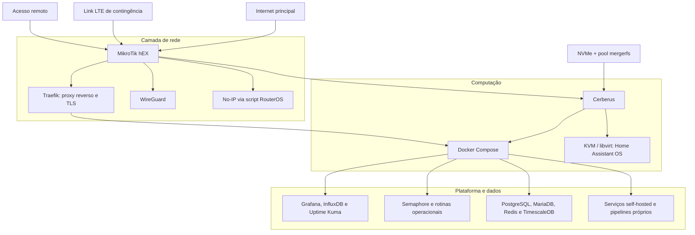

# Cerberus — Homelab de Infraestrutura, Dados e Observabilidade

> Homelab pessoal em operação contínua desde agosto de 2023, criado para praticar e aplicar Linux, containers, virtualização, redes, automação, observabilidade e engenharia de dados em um ambiente real.

## Visão geral

O Cerberus é meu laboratório doméstico de infraestrutura. Ele concentra serviços autocontidos em Docker Compose, uma máquina virtual dedicada ao Home Assistant, armazenamento local agregado, observabilidade e pipelines de dados que desenvolvi para necessidades reais.

Mais do que hospedar aplicações, o projeto serve para exercitar decisões e operações próximas de um ambiente de produção: segmentação de responsabilidades, persistência, monitoramento, acesso remoto seguro, recuperação de falhas, documentação e evolução da arquitetura.

| Indicador | Estado atual |
|---|---:|
| Processamento | 12 núcleos / 24 threads |
| Memória | 32 GiB |
| Pool de armazenamento | 8,2 TiB |
| Containers ativos | 48 |
| Projetos Docker Compose | 37 |
| Máquinas virtuais | 1 |

Os números representam uma fotografia do ambiente em setembro de 2026 e podem mudar conforme o homelab evolui.

## Arquitetura

Uma descrição mais detalhada está em [Arquitetura](docs/architecture.md).

## Destaques de engenharia

- **Plataforma híbrida:** Docker Compose para serviços desacoplados e KVM/QEMU com libvirt para uma VM dedicada ao Home Assistant OS.
- **Rede e acesso:** MikroTik RouterOS com firewall/NAT IPv4, failover para LTE, WireGuard e atualização de DDNS No-IP por script agendado.
- **Publicação centralizada:** Traefik como ponto de entrada para proxy reverso e terminação TLS.
- **Observabilidade:** Grafana, InfluxDB e Uptime Kuma para métricas, séries temporais, dashboards e disponibilidade.
- **Dados:** coletores próprios transformam dados de consumo de energia e testes de conexão em medições consultáveis no InfluxDB.
- **Operação:** Portainer para apoio ao ciclo de vida dos containers e Semaphore para automações e tarefas recorrentes.
- **Persistência:** workloads e dados distribuídos entre NVMe e um pool mergerfs sobre discos locais.

## Workloads em destaque

### Plataforma Minecraft multi-servidor

Um dos experimentos mais completos executados no Cerberus foi uma plataforma Minecraft gerenciada pelo Crafty Controller. A arquitetura combinava um proxy Velocity, lobby dedicado e múltiplos backends Purpur, com entrada para clientes Java e Bedrock por Geyser e Floodgate.

Além do roteamento entre servidores, o ambiente reuniu controle de permissões, proteção e auditoria do mundo, integração com Discord, mapas web e rotinas de backup. Em um teste de capacidade, proxy, lobby e dois backends consumiram cerca de **10,5 GiB de RAM**; por isso, a plataforma foi pausada antes de ser oferecida a jogadores reais. Essa decisão e o estado experimental são partes importantes do estudo, não limitações escondidas.

Veja a documentação em [Plataforma Minecraft](docs/minecraft-platform.md).

### Automação e distribuição de mídia

O pipeline de mídia integra indexação, gerenciamento de catálogo, metadados e legendas, coordenação de downloads e reprodução com Jellyfin e Plex. Radarr, Sonarr, Bazarr e Prowlarr trabalham sobre armazenamento compartilhado, com importação baseada em hardlinks para evitar cópias desnecessárias no mesmo filesystem.

Esse workload também serviu para exercitar mapeamento consistente de volumes entre containers, diagnóstico de importações, deduplicação e organização de dados sobre o pool mergerfs.

## Projetos derivados

| Projeto | Papel no homelab |
|---|---|
| [Ookla Speedtest → InfluxDB](https://github.com/Adrianozk/ookla-speedtest-influxdb) | Executa o CLI oficial da Ookla em container, registra as medições no InfluxDB e inclui um dashboard Grafana importável. |
| [SuaLuz → InfluxDB](https://github.com/Adrianozk/sualuz-influxdb-importer) | Coleta dados de energia, valida e grava séries temporais no InfluxDB, com dashboard para análises diárias, semanais e mensais. |

## Decisões e trade-offs

- **Stacks independentes:** cada conjunto de serviços é administrado como um projeto Compose, reduzindo o acoplamento entre aplicações.
- **VM para automação residencial:** o Home Assistant OS permanece isolado em uma VM com inicialização automática e acesso direto à rede local.
- **mergerfs no estado atual:** oferece flexibilidade para combinar discos heterogêneos sem exigir a reconstrução imediata do armazenamento.
- **ZFS no roadmap:** a migração para RAIDZ1 está planejada para quando houver um terceiro disco de 4 TB e uma janela segura de migração.
- **Exposição controlada:** serviços publicados passam pelo proxy reverso; administração remota é priorizada por VPN.

Veja o registro completo em [Decisões técnicas](docs/decisions.md).

## Organização da documentação

- [Arquitetura e fluxos](docs/architecture.md)
- [Inventário sanitizado](docs/inventory.md)
- [Plataforma Minecraft](docs/minecraft-platform.md)
- [Decisões técnicas e roadmap](docs/decisions.md)
- [Política de segurança da documentação](SECURITY.md)

## English summary

Cerberus is a personal, continuously operated homelab started in August 2023. It combines Linux, Docker Compose, KVM/libvirt virtualization, MikroTik networking, secure remote access, observability, storage management, automation, and custom data pipelines. This repository documents the architecture and engineering decisions while intentionally excluding operational secrets and sensitive network details.

## Autor

[Adriano Fernandes](https://github.com/Adrianozk)
