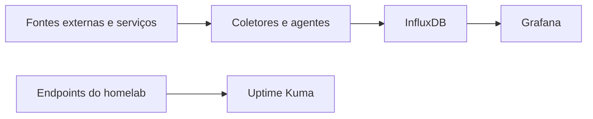

# Arquitetura e fluxos

## Camadas do ambiente

| Camada | Componentes | Responsabilidade |
|---|---|---|
| Borda e conectividade | MikroTik hEX, conexão principal e LTE | Roteamento, firewall/NAT IPv4 e contingência de Internet |
| Acesso remoto | WireGuard e No-IP | Acesso por VPN e descoberta do endereço público dinâmico |
| Entrada de aplicações | Traefik | Proxy reverso e terminação TLS |
| Host | Linux com OpenMediaVault | Base do ambiente, armazenamento e execução das cargas |
| Containers | Docker e Docker Compose | Isolamento e ciclo de vida dos serviços self-hosted |
| Virtualização | KVM/QEMU e libvirt | Execução do Home Assistant OS em VM dedicada |
| Observabilidade | Grafana, InfluxDB e Uptime Kuma | Métricas, séries temporais, dashboards e disponibilidade |
| Automação | Semaphore e scripts | Execução controlada de rotinas operacionais |
| Dados | Coletores próprios e bancos de dados | Ingestão, persistência e consulta de dados |

## Conectividade

O roteador MikroTik é a borda do homelab. Ele administra a conexão principal e o failover para um link LTE, aplica as regras de firewall/NAT IPv4 e fornece acesso remoto por WireGuard.

Como o endereço público pode mudar, um script próprio em RouterOS é executado pelo agendador do equipamento e atualiza o registro no No-IP. Os nomes, endereços, portas e regras operacionais foram omitidos desta documentação.

Para serviços que precisam ser publicados, o Traefik centraliza o roteamento HTTP, o proxy reverso e o TLS. O acesso administrativo é mantido separado e prioriza a VPN.

## Computação

O host Cerberus executa duas formas de isolamento:

1. **Docker Compose**, utilizado para a maior parte dos serviços. As aplicações são separadas em stacks independentes, com redes e persistência próprias conforme a necessidade.
2. **KVM/QEMU via libvirt**, utilizado para o Home Assistant OS. A VM possui 4 vCPUs, 8 GiB de memória, disco QCOW2 em SSD, inicialização automática e interfaces VirtIO para integração com a rede local e com a rede virtual do hipervisor.

## Fluxos de observabilidade e dados

Dois fluxos autorais estão documentados em repositórios próprios:

- [Ookla Speedtest → InfluxDB](https://github.com/Adrianozk/ookla-speedtest-influxdb), para histórico de desempenho da conexão e comparação entre servidores de teste;
- [SuaLuz → InfluxDB](https://github.com/Adrianozk/sualuz-influxdb-importer), para análise do consumo e custo de energia em diferentes granularidades.

## Armazenamento

O sistema e os dados de maior atividade utilizam o NVMe. Os discos de capacidade são combinados em um pool mergerfs, permitindo reunir volumes heterogêneos sob um namespace único sem esconder a natureza individual de cada filesystem.

A evolução planejada é migrar os dados adequados para ZFS RAIDZ1 após a adição de um terceiro disco de 4 TB. Até lá, ZFS deve ser tratado como roadmap, não como parte da arquitetura atual.
