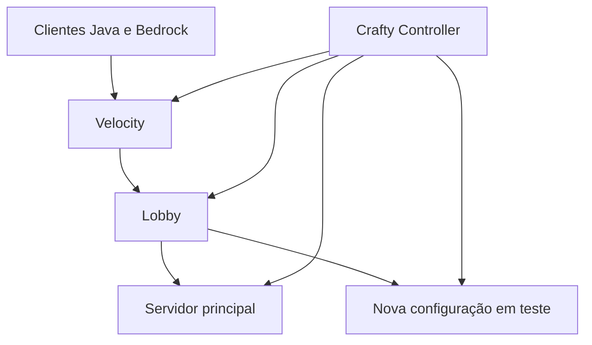

# Plataforma Minecraft multi-servidor

## Visão geral

O Cerberus hospedou um ambiente experimental para validar uma plataforma Minecraft multi-servidor administrada pelo Crafty Controller. O objetivo era concentrar gerenciamento, acesso Java e Bedrock, roteamento entre instâncias, permissões, proteção, integrações e backups antes de disponibilizar o serviço a jogadores reais.

O ambiente foi pausado após os testes de capacidade. As configurações e os backups foram preservados para estudo e possível retomada, mas a plataforma não deve ser interpretada como um serviço em produção.

## Arquitetura validada

O inventário do Crafty continha **9 servidores cadastrados**, incluindo instâncias atuais, anteriores e de teste. Durante a validação da nova topologia, quatro processos Java principais estavam ativos ao mesmo tempo:

- proxy Velocity;
- lobby dedicado;
- backend principal;
- backend com a nova configuração em avaliação.

O proxy direcionava os jogadores primeiro ao lobby. A partir dele, a seleção de servidores permitia o encaminhamento aos backends. Identificadores, portas, caminhos, endereços e configurações operacionais foram removidos desta documentação.

## Compatibilidade e experiência de entrada

Geyser e Floodgate foram instalados na camada do proxy para permitir a entrada de clientes Java e Bedrock. O lobby utilizava componentes para seleção de servidores, portais, múltiplos mundos, hologramas e uma atividade de parkour.

Essa separação permitia tratar a chegada do jogador e o encaminhamento como responsabilidades próprias, sem acoplar toda a experiência ao servidor principal.

## Administração e segurança do jogo

O conjunto de componentes variava entre proxy, lobby e backends, mas atendia a grupos funcionais claros:

| Função | Soluções representativas |
|---|---|
| Administração central | Crafty Controller |
| Proxy e roteamento | Velocity |
| Compatibilidade | Geyser e Floodgate |
| Permissões | LuckPerms |
| Proteção e auditoria | WorldGuard, GriefPrevention e CoreProtect |
| Comunicação | DiscordSRV e Simple Voice Chat |
| Mapas web | BlueMap e Squaremap |
| Operação | Maintenance, monitoramento e ferramentas administrativas |

As versões exatas e a lista integral de plugins não fazem parte do contrato da arquitetura, pois mudam entre instâncias e atualizações.

## Backups e rotinas operacionais

Os perfis de backup usavam dois níveis de armazenamento:

- SSD para instâncias de teste, lobby, proxy e alguns estados intermediários;
- pool mergerfs para servidores que exigiam maior capacidade e arquivos compactados.

Nos fluxos principais, foram configuradas etapas de aviso no jogo e no Discord, parada controlada do servidor, criação do backup e reinicialização. A inspeção encontrou aproximadamente **19 GiB de arquivos históricos** somando os dois destinos, incluindo execuções recentes e estados anteriores da plataforma.

Os perfis permanecem registrados, mas as tarefas agendadas estão atualmente desativadas porque o ambiente foi pausado.

## Avaliação de capacidade

Com proxy, lobby e dois backends em execução, o container do Crafty utilizou aproximadamente **10,5 GiB de RAM**, cerca de um terço da memória física do Cerberus. A maior parte do consumo vinha das três instâncias Purpur; o painel de controle representava apenas uma fração da carga.

O resultado mostrou que a arquitetura funcionava, mas competia diretamente com bancos de dados, observabilidade, automação residencial e serviços de mídia já mantidos no host. Por isso, o projeto foi interrompido antes da abertura ao público.

## Aprendizados

- modelar proxy, lobby e servidores de jogo como responsabilidades independentes;
- integrar clientes Java e Bedrock na borda da plataforma;
- planejar permissões e encaminhamento de identidade entre proxy e backends;
- coordenar avisos, parada, backup e reinicialização de serviços stateful;
- distribuir backups entre armazenamento rápido e armazenamento de capacidade;
- medir a carga consolidada antes de transformar um protótipo funcional em serviço contínuo;
- preservar documentação e dados suficientes para permitir uma retomada consciente.

## Estado atual

**Pausado após validação técnica e avaliação de capacidade.** O ambiente chegou ao estágio de proxy, lobby, múltiplos backends, compatibilidade Java/Bedrock e backups automatizados, mas não foi disponibilizado como serviço permanente para jogadores reais.
